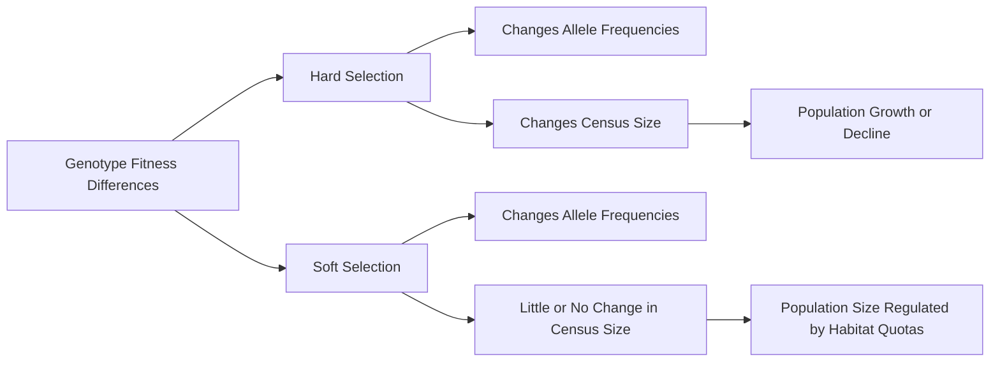

# Hard vs. Soft Selection
## Notation  

Consider a single bi-allelic locus with alleles $i$ and $j$.  

The three diploid genotypes are  

$$X_{ii},\; X_{ij},\; X_{jj}.$$  

Their corresponding frequencies are  

$$x_{ii},\; x_{ij},\; x_{jj},$$  

where  

$$x_{ii}+x_{ij}+x_{jj}=1.$$  

Allele frequencies are denoted  

$$p_i=x_{ii}+\frac{1}{2}x_{ij}$$  

and  

$$p_j=x_{jj}+\frac{1}{2}x_{ij}.$$  

Let $X_k$ refer to any genotype, where $k \in \{ii,ij,jj\}$.  

The frequency of genotype $X_k$ is denoted $x_k$.  

Let $z$ denote an arbitrary habitat.  

The fitness of genotype $X_k$ in habitat $z$ is  

$$w_{kz}.$$  

The fraction of individuals experiencing habitat $z$ is  

$$c_z.$$  

---  

# Hard Selection  

Under hard selection, habitat-specific fitnesses are averaged first to obtain a global fitness for each genotype:  

$$W_k=\sum_z c_z w_{kz}.$$  

Mean population fitness is  

$$\overline{W}=\sum_k x_k W_k.$$  

After selection, genotype frequencies become  

$$x_k'=\frac{x_kW_k}{\overline{W}}.$$  

Equivalently,  

$$x_k'=\frac{x_kW_k}{\sum_k x_kW_k}.$$  

Population size changes according to  

$$N_{t+1}=N_t\overline{W}.$$  

The key feature of hard selection is that habitats contribute offspring in proportion to their productivity. Habitats that produce more surviving individuals contribute more to the next generation.  

---  

# Soft Selection  

Under soft selection, selection occurs within habitats before habitats contribute individuals to the next generation.  

The mean fitness within habitat $z$ is  

$$\overline{w}_z=\sum_k x_k w_{kz}.$$  

Following selection within habitat $z$, genotype frequencies become  

$$x_{kz}'=\frac{x_kw_{kz}}{\overline{w}_z}.$$  

Habitats are then pooled according to their fixed contributions:  

$$x_k'=\sum_z c_z\frac{x_kw_{kz}}{\overline{w}_z}.$$  

Unlike hard selection, habitat contributions are fixed and do not depend on how many individuals survive within each habitat.  

---  

# The Fundamental Difference  

Under hard selection,  

$$W_k=\sum_z c_zw_{kz},$$  

meaning that fitnesses are averaged across habitats before selection operates.  

Under soft selection,  

$$x_k'=\sum_z c_z\frac{x_kw_{kz}}{\overline{w}_z},$$  

meaning that selection acts independently within habitats before habitats are pooled.  

This difference in the order of averaging and selection generates the distinct evolutionary consequences of hard and soft selection.  


# Take Home Message  

  

> Hard selection occurs before density regulation, whereas soft selection occurs after density regulation.  

  

Equivalently,  

  

> Under hard selection, fitness differences affect both population size and genotype frequencies. Under soft selection, fitness differences primarily affect genotype frequencies because each habitat contributes a fixed share of the next generation.  

Consequently, hard selection often favors the genotype with the highest global average fitness, whereas soft selection frequently maintains genetic variation in heterogeneous environments.

### The impact on overall vs deme sensus sizes

The key distinction between hard and soft selection is not whether selection occurs, but how local habitats contribute individuals to the next generation. Under hard selection, a habitat's contribution depends on how many individuals survive and reproduce there. More productive habitats therefore contribute more descendants to future generations. Under soft selection, each habitat contributes a fixed number or proportion of individuals regardless of its productivity. Selection acts within habitats, but habitat contributions are regulated before individuals are pooled into the next generation. The diagram below illustrates this difference.

```mermaid  

flowchart TD  

  

A[Initial Population]  

  

A --> H1[Habitat 1]  

A --> H2[Habitat 2]  

  

subgraph Hard Selection  

H1 --> HS1[80 Survivors]  

H2 --> HS2[20 Survivors]  

  

HS1 --> HN[Next Generation<br/>100 Total]  

HS2 --> HN  

end  

  

subgraph Soft Selection  

H1 --> SS1[80 Survivors-> reproduce -> Produce 800 offspring]  

H2 --> SS2[20 Survivors -> reproduce -> Produce 200 offspring]  

  

SS1 --> SQ1[50 Individuals survive (carry capacity; k)]  

SS2 --> SQ2[50 Individuals survive (carry capacity; k)]  

  

SQ1 --> SN[Next Generation<br/>100 Total]  

SQ2 --> SN  

end  

```

### Distinctions of the model
Because hard and soft selection differ in how fitness influences demographic contributions, they generate different expectations for census population size through time. Under hard selection, mean fitness directly determines population growth, such that low fitness can cause population decline and high fitness can promote population expansion. In contrast, under idealized soft selection, density regulation constrains each habitat to contribute a fixed number of individuals, decoupling changes in genotype frequencies from changes in total population size. Consequently, allele frequencies may evolve rapidly while census size remains relatively constant. The figure below summarizes these contrasting demographic outcomes.
