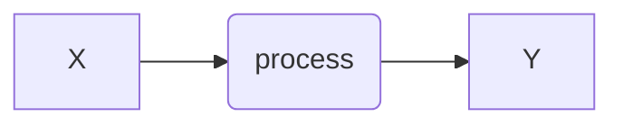
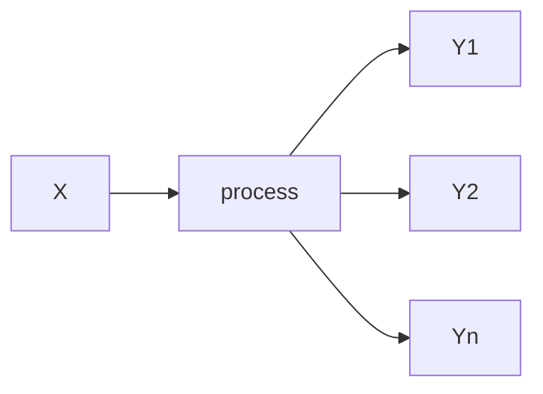

# Recitation 8: Genetic drift and effective population size

Genetic drift is the random change in allele frequencies in a population due to chance, especially in small populations, leading to reduced genetic variation over time. Effective population size ($N_{e}$​) measures the number of individuals contributing to the gene pool, often smaller than the actual population size ($N$) due to factors like unequal sex ratios or reproductive variation. Both these concepts are related to each other as smaller Ne intensifies genetic drift, increasing the loss of genetic variation and the risk of inbreeding.

In this recitation, we will explore the dynamics of drift (from lecture 20) and $N_{e}$ (from lecture 21), **while also expanding our previously worked example** of *seasonal evolution*.

### Step 1: Understanding the genetic drift algorithm

You probably noticed that we never fully explored the “formula” to estimate $p_{t+1}$ as a result of the drift process in class. The reason for this is that drift is what we call an "stochastic process".  **A stochastic process is** a mathematical model that describes the evolution of a system over time, incorporating inherent randomness. In these processes, the system's next state is determined by a mix of deterministic rules and probabilistic factors. This combination introduces uncertainty, making it impossible to precisely predict the system's exact state after one time step. However, we can estimate the likelihood of various outcomes using probability distributions, which allow us to understand the potential behavior of the system. This stands in contrast to deterministic processes, where the system's future states are entirely determined by its initial conditions and governing equations, without any randomness. In a deterministic process, the same starting conditions will always produce the same outcome, making the system fully predictable.

## Example of Deterministic processes 


### some non-biology examples

$$
a = F/m 
$$
> Newton's classic formula of accelation. $a$ is acceleration, $F$ is force, and $m$ is mass.
> 
$$
y =x(1+r/m)^{Ym}
$$
> Formula for compound interest. $x$ is the current value, $y$ is future value. $r$ is the interest rate, $m$ is months, $Y$ is years.

### Biology examples
Selection:

$$p_{t+1} =\frac{p^2 (1-s_{ii}) + pq(1-s_{ij}) }{p^2 (1-s_{ii} ) + 2pq(1-s_{ij})+q^2 (1-s_{jj})}$$

## Example of Deterministic processes 


### some non-biology examples

#### flipping a coin:
$$
P(Success) = P(X=1) = p
$$

> Where 1 is "heads"

$$
P(Failure) = P(X=0) = 1 - p
$$

>Where 0 is "tails"

 Other than genetic drift, stochastic processes are widely used to model unpredictable phenomena in fields like physics, finance, and computer science, such as stock market fluctuations or random walks.

To predict allele frequencies evolving due to genetic drift, **a binomial function can model** the random sampling of alleles from one generation to the next. If p represents the current frequency of an allele, and Ne is the effective population size, the number of copies of the allele in the next generation can be modeled as a binomial distribution with 2Ne trials and probability p. This reflects that 2Ne alleles are sampled with replacement, each having a probability p of being chosen. Over generations, this stochastic process captures how random fluctuations may lead to allele fixation or loss.

* Let's build a formula to simulate this process. For this simulation we will parametrize the function using the effective population size ($N_{e}$) concept that we learned in lecture 21.
* Recall that $N_{e}$ in genetics refers to the number of individuals in an idealized population that would experience the same degree of genetic drift or inbreeding as the actual population, often differing from the total population size due to factors like, for example, unequal sex ratios, variation in reproductive success, and fluctuating population sizes.

```{r}
#Imagine a population of 500 diploid individuals
Ne = 500
p = 0.5

drift_p_t1 = function( p, Ne ){
num=rbinom(1, Ne, p)
dem=Ne
p_t1 = num/dem
return(p_t1)
}
```
### Step 2: Simulate genetic drift overtime

Building on the recursive approach we've developed in previous recitations, we will now apply it to evaluate the drift function, just as we have done with other evolutionary forces. This method will allow us to systematically analyze, and visualize, how genetic drift influences allele frequencies over time.

```{r}
p_recur=c()

for(g in 1:100){
	if(g==1){
	p_recur[g]=p
			} else{
			p_recur[g] =drift_p_t1(<?>, <?>)
			} # close if-else
} # close loop
```
<<QUESTION 1: What are the parameters that are needed to run the drift simulator?>>

Lets graph the output of our simulation
```{r}
#create a dataframe to save your results
drift_population = data.frame(g=1:100, p_recur)
plot(drift_population$g, drift_population$p_recur, type ='l',ylim=c(0,1), ylab="Allele Freq", xlab="Generation")
```
<<QUESTION 2: Print this graph in your report and describe what is happening. Note that, because of the stochastic nature of the simulations, your results will be unique!!! This may look similar or totally different from your peers… or from a previous iteration>>

### Step 3: Let’s explore the randomness of the drift process.

Let's explore the randomness and unpredictability of genetic drift. This code simulates the change in allele frequency over time due to genetic drift using a recursive approach.

-   It runs 50 independent simulations (the outer loop).
    
-   For each simulation, it tracks allele frequency over 100 generations (the inner loop).
    
-   Initially, in generation 1, the allele frequency is set to a starting value ppp.
    
-   For each subsequent generation, the function `drift_p_t1()` is applied to compute the new allele frequency based on the previous generation’s value and the effective population size ($N_{e}$​).

```{r}
various_drift = list()

for(i in 1:50){
	p_recur=c()
	for(g in 1:100){
		if(g==1){
		p_recur[g]=p
		} else{
		p_recur[g] =drift_p_t1(<?>, <?>) ## <-- fill in here!!!
	} # close if-else
} # close g loop

various_drift[[i]] = data.frame(g=1:100, scenario= i, p_recur);
p_recur=c()
} # close i loop

```
<<QUESTION 3: Print this graph in your report and describe what is happening. Reflect on the implications of these outcomes specialle on how it compares to natural selection? Reflect on this: *is evolution a predictable process?* (think of evolution a the combination of selection and drift)>>

### Step 4: integrating drift and selection. Revisiting the seasonal model.

Let's explore the randomness and unpredictability of genetic drift in a biologically interesting context. Recall that in *Drosophila melanogaster* the ecological dynamics of seasonality provides a natural framework for studying evolutionary dynamics and adaptation. Seasonality in *Drosophila* refers to the cyclical changes in their populations, behaviors, and genetic composition in response to seasonal environmental fluctuations, such as temperature, humidity, and resource availability. For example, during warmer months, Drosophila melanogaster populations tend to expand rapidly due to favorable conditions. Consequently, the effective population size of fly populations in the summer is usually much larger than that of the winter.

* As such, we will develop a model of seasonality that incorporates both selection and drift as follows:

$$p_{t+1}=p +\Delta_{s|seas}p +\Delta_{D}p $$

Where $\Delta_{s|seas}p$ is the evolutionary component due to seasonal selection and $\Delta_{D}p$ is the evolutionary component due to drift.

For the seasonal component we will model seasonal fitness and demography as follows:

|geno/seas|xii|xij|xjj|Ne|
|---|---|---|---|---|
|summer|1|0.8|0.6|1000|
|winter|0.6|0.8|1.0|200|

### Step 5: Set up the simulation

Now we will set up the simulation, and we will condition the generation counter to vary its behaviour for summers and winters. We will use the general selection formula as it is more versatile for temporal models:

#### Import the formula for selection from previous recitations. recall it is:

```{r}
general_selection = function( p, sii, sij, sjj ){
q=1-p
num=(p^2)*(1-sii) + p*q*(1-sij)
dem=(p^2)*(1-sii) + 2*p*q*(1-sij) + (q^2)*(1-sjj)
p_t1 = num/dem
return(p_t1)
}
```

#### Import the seasonal framework from recitation 3
We will update the framework to include genetic drift

```{r}
#define an initial allele frequency, and the empty variable for "recursive" use
p=0.5

#and the empty variable for "recursive" use
p_recur=c()
Ne_recur=c()

#lets simulate 100 generations

for(g in 1:100){
if(g==1){
p_recur[g]=p
Ne_recur[g]=1000
} else{
	if(grepl("[0-4]$", g)){
	print("summer")
	sii=0.0
	sij=0.2
	sjj=0.4
	Ne = 1000
}else if(grepl("[5-9]$", g)){
	print("winter")
	sii=0.4
	sij=0.2
	sjj=0.0
	Ne = 200
}

#selection
p_delta_s = general_selection(p_recur[g-1], sii, sij, sjj) - p_recur[g-1]

#drift <----- HERE WE ARE INTRODUCING DRIFT
p_delta_d = drift_p_t1(<?>, <?>) - p_recur[g-1]

#predict allele frequency next generation
p_recur[g] = p_recur[g-1] + p_delta_s + p_delta_d
Ne_recur[g] = Ne

} # close if-else
} # close loop
```

#create a dataframe to save your results

seasonal_selection_drift = data.frame(g=1:100, p_recur, Ne_recur)

### Step 6: Plot the simulations
```{r}
plot(seasonal_selection_drift$g, seasonal_selection_drift$p_recur, type ='l',ylim=c(0,1), ylab="Allele Freq", xlab="Generation")
```
  <<QUESTION 4: Print this graph in your report and describe what is happening. What is the impact of genetic drift in the dynamics of natural selection?>>

### Step 7: Challenge → What is the effective population size of this population?

Our fly population has an $N_e$ size of 5000 in the summer and 200 in the winter, and these values repeat in a cyclical pattern. In this question, what is the “long-term effective population size” of the population? See the mathematical necessities for this in Lecture 20.

<<QUESTION 5: Develop code to determine the long term effective population size for this population, simulate 100 generations… report the long term effective population size for this population >> … hint you can use the “Ne_recur” column in the *seasonal_selection_drift* object
